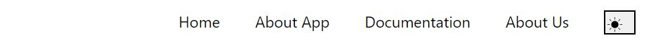
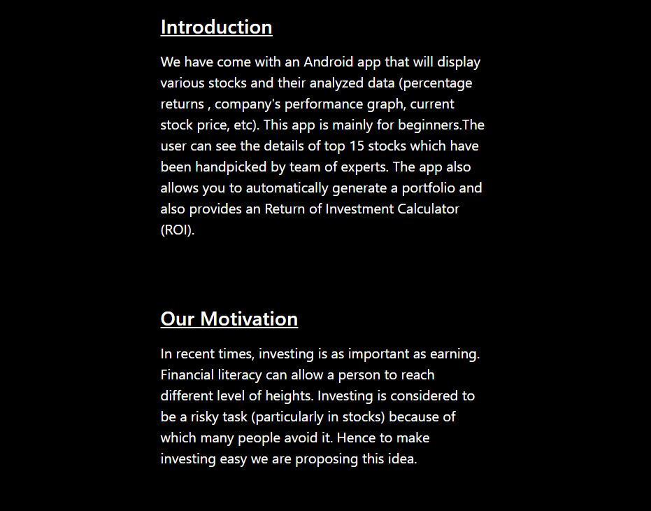
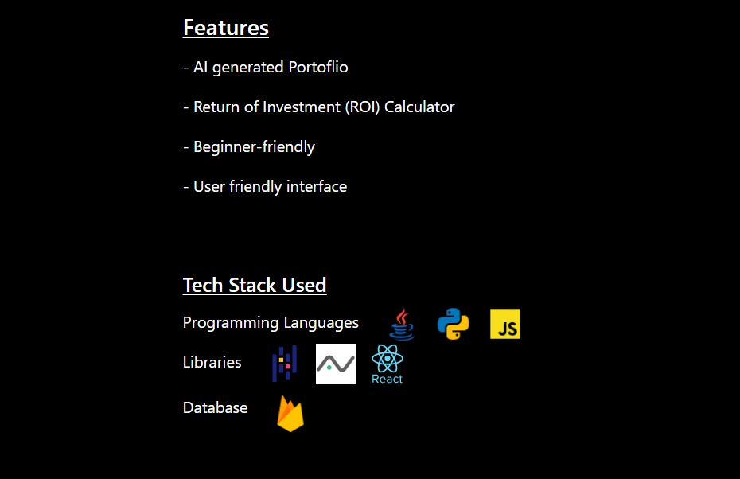
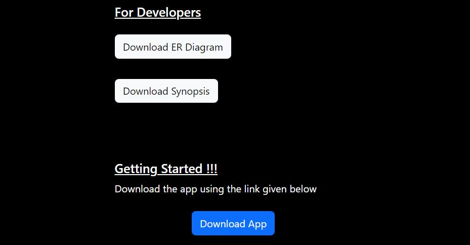
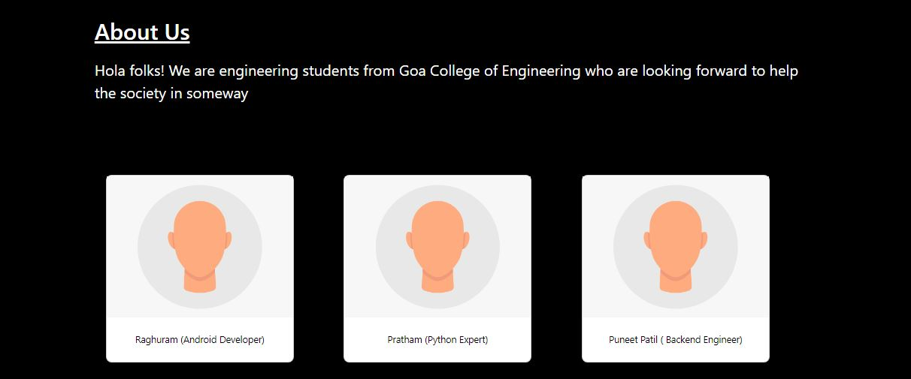
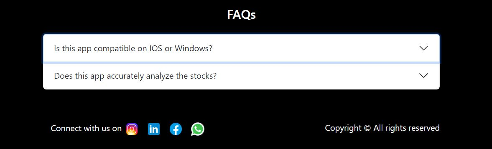

## 
<u>InvestoReady Web App </u>

#### <u>Introduction</u>
This web application was made so that one can download our Android application <strong>InvestoReady</strong>  which was made as a part of our DBMS Project.

#### <u>Logo</u>

#### <u>Screenshots</u>

#### <u>Tech / Framework Used</u>

1. <u> Programming Languages</u>

2. <u>Libraries</u>

#### <u>Features</u>
- Dark Mode / Light Mode Available
- Well documented

#### <u>More</u>
<a href = "https://github.com/puneetmpatil/InvestoReady">Source code of our application</a>
